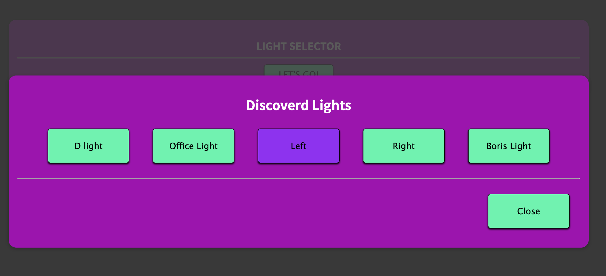
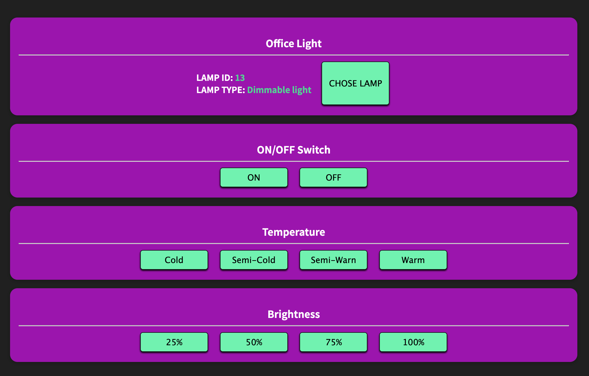
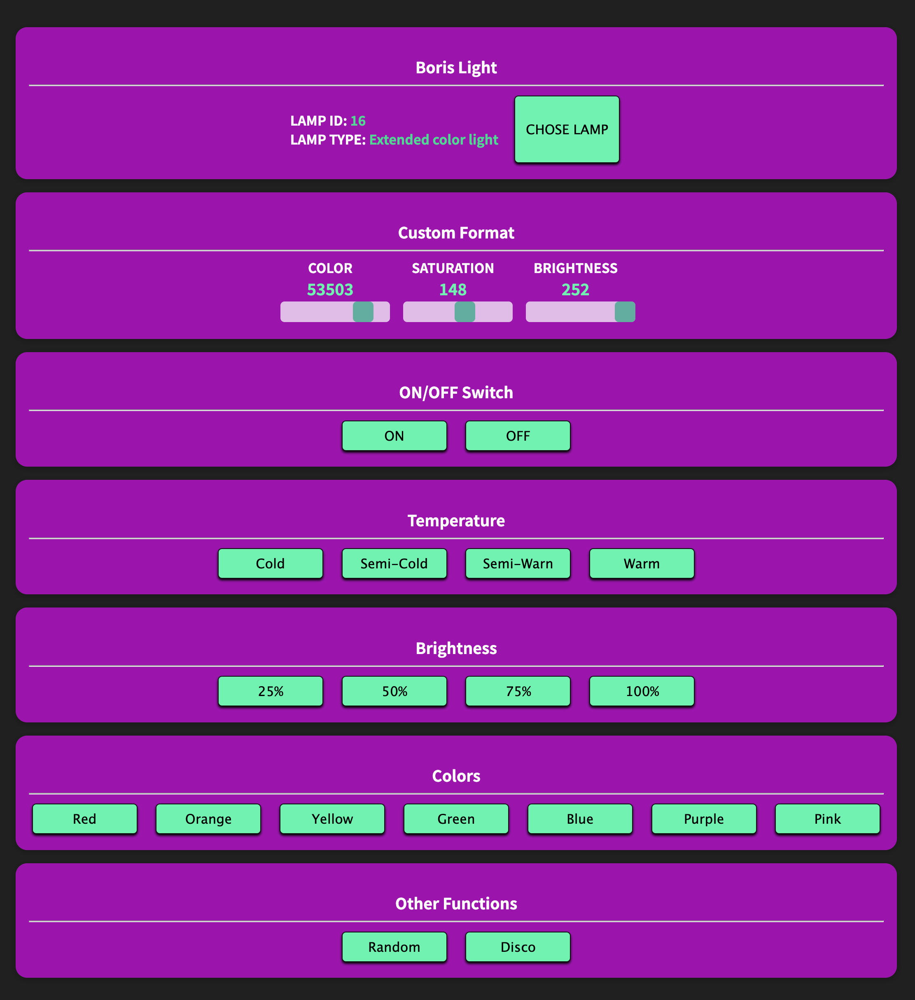

# Philips Hue Lights Control

#### Title: Hue Lights Control

##### Author: Dmitry Demin

This app can be used to control your hue lights. It can automatically detect your bridge IP and help you setup your userID. App will automatically collect information about all lights connected to the hub and list them for you to choose.

The menus render depending on lights capabilities - does the light have color selection, temperature control, etc.

---

###### Main Status Screen

###### Light Selector

###### Dimmable Light

###### Color Light

#### How To Start

1. Clone Repo
2. In the project directory, run `npm install`
3. `npm start`

#### Live Demo

No Demo - this has to run on a local network. To try - download and run.

#### Note

For this to work, you will need to have Philips Hue with hub on your local network.
